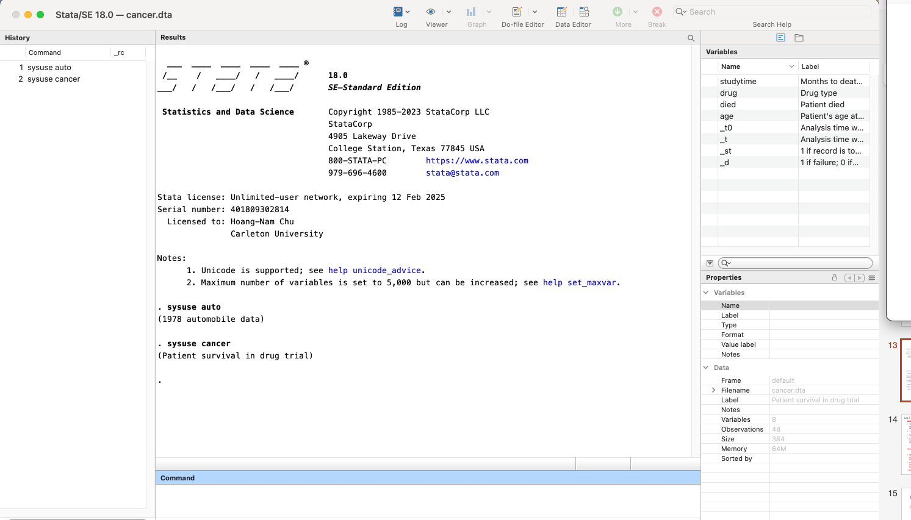
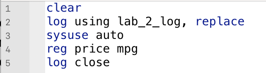

```{r, include=FALSE}
library(Statamarkdown)
```

### Introduction
Now that you’ve explored STATA’s interface, we will now be exploring STATA’s functions that allow you to preserve your work. 

### Lab Overview

After this lab, you should be able to:  

1. Open up STATA’s Do file Editor,
2. Save your work to a log file.

#### Do Files

In the last lab, we explored STATA’s graphical user interface. In order to remind you of what we last did, 

<div style="border: 2px solid black; padding: 10px; margin: 10px 0;">
<strong>type in `sysuse auto` into the Command window (CW).</strong>
</div>

This tells STATA to load in the `auto` dataset that comes preloaded with STATA. Of course, there are other datasets that come preloaded with STATA, which you can find <a href="https://www.stata.com/links/stata-basics/example-datasets/" target="_blank">here</a>. 

If you visit the website, you can see that there exists another example dataset called `cancer`. Let’s try to load it in as well.

<div style="border: 2px solid black; padding: 10px; margin: 10px 0;">
<strong>type `sysuse cancer` in the CW.</strong>
</div>



Notice that there are two commands in both the history and results windows. 

<div style="border: 2px solid black; padding: 10px; margin: 10px 0;">
<strong>Open up the browse mode of the data editor.</strong>
</div>

If you pay close attention to the title, you will see that you are looking at the data for `cancer`. What happened to the `auto` dataset? Well, it got overwritten. 

<strong>In STATA, you can only load one dataset at a time.</strong> If you are used to other programming languages, like R, this will be something you have to get used to. 

<div style="border: 2px solid black; padding: 10px; margin: 10px 0;">
<strong>close the window and go back to the initial STATA screen.</strong>
</div>

When you’re using non-system data, STATA will try to prevent you from overwriting your data, by insisting that you first explicitly “clear” the existing data from memory. 

<div style="border: 2px solid black; padding: 10px; margin: 10px 0;">
<strong>type `clear` in the CW.</strong>
</div>

{width=auto}
<br><br/>
As its name indicates, this command has cleared out STATA’s memory of the previous dataset. Let’s try to import other example datasets. After loading each dataset, explore it a bit before loading another one in.

<div style="border: 2px solid black; padding: 10px; margin: 10px 0;">
<strong>type `sysuse voter` in the CW.</strong> <br>
<strong>type `sysuse census` in the CW.</strong>
</div>

Now, clear your memory using the clear command. 

<div style="border: 2px solid black; padding: 10px; margin: 10px 0;">
<strong>type `clear` in the CW.</strong>
</div>

As you can see, our history window is beginning to get filled with commands. You can probably tell that the more commands that you enter, the harder it will be to find certain commands, or even retrace our steps. 

<strong>TIP: To make a previous command appear in your Command window, press (mac: fn+up, windows: pgup)</strong>

This is where do files come in handy. Do files are like a paper trail that lets us record the code that we've used to accomplish a certain task. You can access the do-file editor by clicking the  Do-file Editor icon in the toolbar.

The Do-file Editor looks like a text editor. We can start populating it with some of our previous commands. 

<div style="border: 2px solid black; padding: 10px; margin: 10px 0;">
<strong>type `sysuse auto`, `sysuse cancer` and `sysuse voter`, each on their own line.</strong>
</div>


To run your commands, you can use the play button located at the top right of the editor. 


Pressing the play button will run all the commands from the top of the file to the bottom, line by line. You can also choose to run each line separately by choosing it from the list of options in the drop down menu next to the play button.

<strong>Tip: You can use (mac/windows: ctrl+d) to run the do-file from top to bottom,  but also (mac/windows: shift+ctrl+d) to run each command line-by-line.</strong>

<div style="border: 2px solid black; padding: 10px; margin: 10px 0;">
<strong>Go back to your results screen.</strong>
</div>


You should see something like this: it executed your code! Now you don’t have to remember every single thing that you type into the Command window. Notice also that there’s a new command in the history window. <strong>The neat thing about STATA is that you can use its graphical user interface and the associated STATA code will pop up in the results window. This is a great way of learning STATA code as a beginner.</strong>

<div style="border: 2px solid black; padding: 10px; margin: 10px 0;">
<strong>Go back to the Do Editor and add `clear` to the top of the file.</strong>
</div>

This is good practice because if you run the code from top to bottom, it will clear any pre-existing datasets in your memory. 

<div style="border: 2px solid black; padding: 10px; margin: 10px 0;">
<strong>erase `sysuse cancer` and erase `sysuse voter` but leave `sysuse auto`. Run your do-file.</strong>
</div>

<div style="border: 2px solid black; padding: 10px; margin: 10px 0;">
<strong>Type `browse` in the CW.</strong>
</div>

This allows you to access the data-editor without using your mouse. Now we're going to run a linear regression on the price and mpg variables. If you are not familiar with linear regressions, you will see it more during the second half of the course. 

<div style="border: 2px solid black; padding: 10px; margin: 10px 0;">
<strong>type `reg price mpg` on a new line after `sysuse auto`. Rerun the do-file.</strong>
</div>


This command tells STATA to run a linear regression of the `price` variable on the `mpg` variable. All you need to know is that this is one of many commands that STATA can accomplish. On your results window you should see a table with a bunch of numbers. This tells us some very important information. Let’s say you wanted to preserve this results page, including the table in a file, how would you do this? This is where Log files come in handy.

#### Log Files

If do-files are like the recipes, log files are like Instagram-ready photos of the cakes you made with those recipes. Log files keep track of everything that you see in the results screen. This could come in handy if you want to show your work to someone or check your results at a later date. 

<div style="border: 2px solid black; padding: 10px; margin: 10px 0;">
<strong>type `log using lab_2_log` after `clear` in your do-file.</strong>
</div>

This will initiate a log file that will capture all the results thereafter called `lab_2_log`. The results window will indicate the <a href=cheatsheets.html target="_blank"> file path</a> where your log file is stored. We will cover paths in lab 3, but you can think of it as the address to your file on your computer. 

If you have already created a log file in the same place with the same name, you will get an error message. If you want to keep the original log file, come up with a new name for this version, but if you want to overwrite the log file with the new version , you’ll need to type:

<div style="border: 2px solid black; padding: 10px; margin: 10px 0;">
<strong>type `log using lab_2_log, replace`</strong>
</div>

It’s also good practice to stop logging at the end of your file. 

<div style="border: 2px solid black; padding: 10px; margin: 10px 0;">
<strong>type `log close` after `reg price mpg`</strong>
</div>



This will stop logging and close the file. For now, you can save your do-file in whatever folder you would like.

<div style="border: 2px solid #4CAF50; padding: 15px; border-radius: 5px; background-color: #f9fff9;">
<b>Congratulations, you have completed the lab!</b>
</div>


<div class="tocify-extend-page" data-unique="tocify-extend-page" style="height: 0;"></div>
