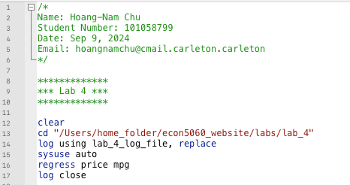
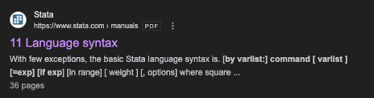
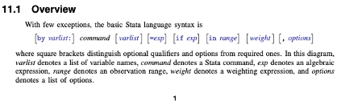
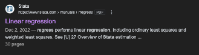
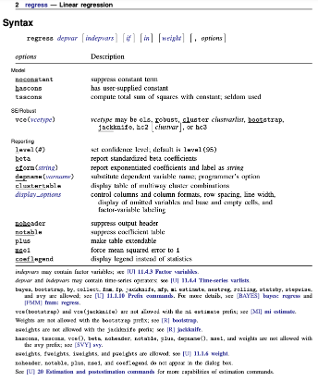
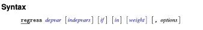
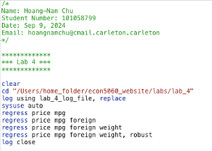

```{r setup, include=FALSE}
library(Statamarkdown)
```

#### Introduction
In this lab we will be looking at STATA's language syntax. This will allow us to understand how to properly write our own commands.

#### Lab Overview
In this lab you will be learning how to:  

  1. Read STATA's official documentation.
  2. Understand STATA's language syntax.

<hr>

Let's begin by re-coding our previous lab's contents. 

<div style="border: 2px solid black; padding: 10px; margin: 10px 0;">
<strong>Open up a new do file. Type the following script, adjusting any parts as appropriate (e.g., your name, student number, and paths).</strong>
</div>


Now we'll practice looking up information from STATA's official documentation. 

<div style="border: 2px solid black; padding: 10px; margin: 10px 0;">
<strong>Go to Google and look up "STATA language syntax". Click on the official STATA documentation for language syntax. It should look like the screenshot below.</strong>
</div>



<div style="border: 2px solid black; padding: 10px; margin: 10px 0;">
<strong>Scroll down until the end of page one where you will see STATA’s syntax:</strong>
</div>



This can be difficult to understand so let's focus on the words <strong> command, [varlist] and [, options] </strong>.

Here is a quick summary of STATA's language syntax. 

1. The only thing that is necessary when you state a command is the `command` itself, anything else that is in brackets is optional.
2. `Varlist` means a list of variables. For example, when we wrote `regress price mpg`, price and mpg are variables.
3. `[, options]` are optional helper commands. These are additional commands that occur in addition to our main command. 
4. In STATA, spaces matter so the `command`, `varlist` and `options` should all be separated by spaces. This is a little different than other coding languages or even Excel.

Take a look at your `log` command, maybe you haven’t noticed but we’ve already been using commands and their options.

<strong>TIP: Anytime you don’t understand what a command does, look it up in the official STATA documentation. If this is not clear, try googling it for an alternative answer.</strong>

<div style="border: 2px solid black; padding: 10px; margin: 10px 0;">
<strong>Type in "regress stata documentation" on Google. Click on the official STATA documentation for Linear regression. Scroll down until you see the syntax page.</strong>
</div>



Now we'll expand on the `regress` command that we've used previously. 

<div style="border: 2px solid black; padding: 10px; margin: 10px 0;">
<strong>Type in the following below `regress price mpg` in your do file.</strong>
</div>

```{stata, eval=FALSE}
regress price mpg foreign
regress price mpg foreign weight
regress price mpg foreign weight, robust
```

As you can see, we've called the `regress` command on a variety of variables and even used the `robust` option that comes with the `regress` command. 

<strong>Tip: In STATA, you don’t have to type in the full name of a command. The underlined portion tells you the shortest allowable written version of the command. If you are a beginner, I would suggest that you type out all the longform versions of the command for practice and for readability.</strong>

 

Your entire do file up to this point should look like this:



<div style="border: 2px solid #4CAF50; padding: 15px; border-radius: 5px; background-color: #f9fff9;">
<b>Congratulations, you have completed the lab!</b>
</div>

<div class="tocify-extend-page" data-unique="tocify-extend-page" style="height: 0;"></div>